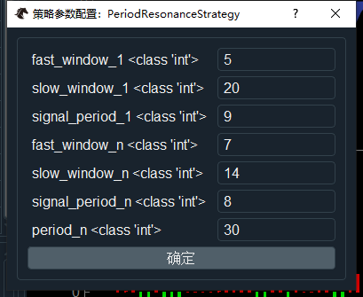
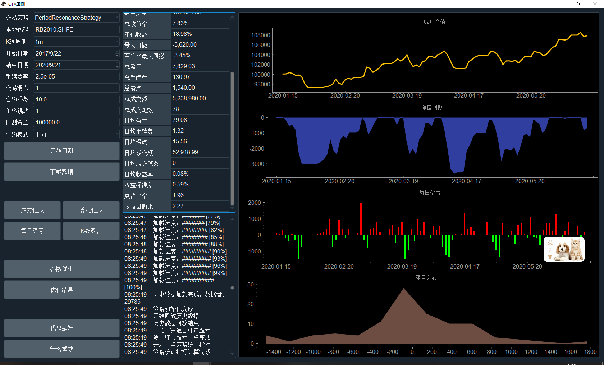
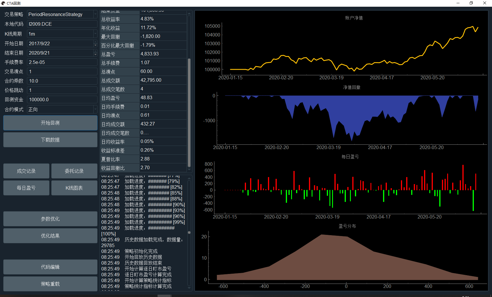
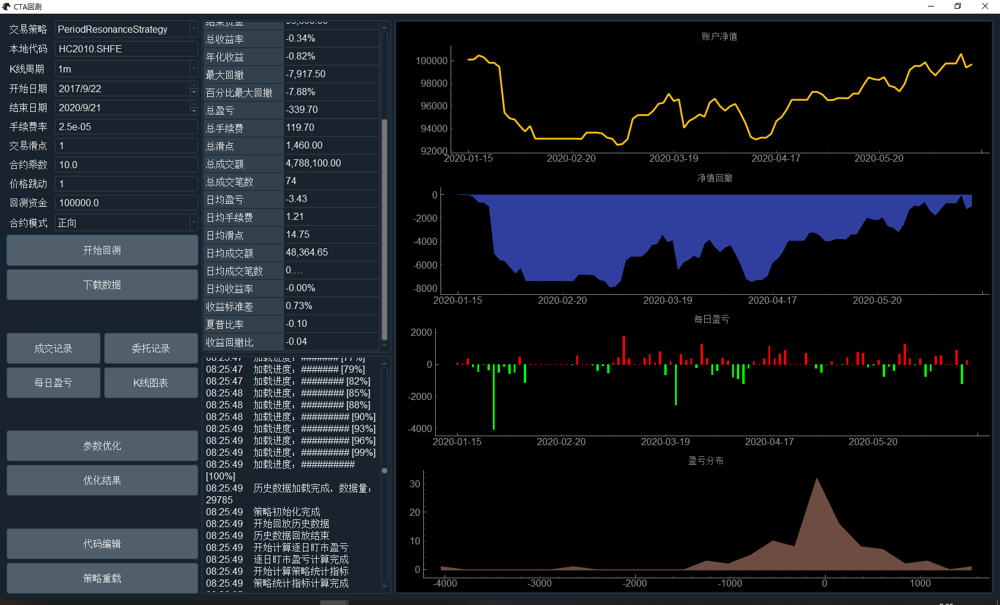

# 多周期共振策略 

### 一、策略思路：
采用1分钟线与30分钟线共振，参考指标MACD

### 二、回测参数

参数优化范围
在RB2010.SHFE合约上，30分钟周期 signal_period_n 参数 7~11区间表现都比较稳定
形成一个在卡玛比上形成一个弧形顶曲线。

### 三、回测效果
同期螺纹、铁矿石表现比较稳定

热卷上无法盈利，主要是2月份春节期间的一次大幅回撤导致，后期的利润逐步累积勉强弥补年初的亏损

RB2010.SHFE

I2009.DCE

HC2010.SHFE

